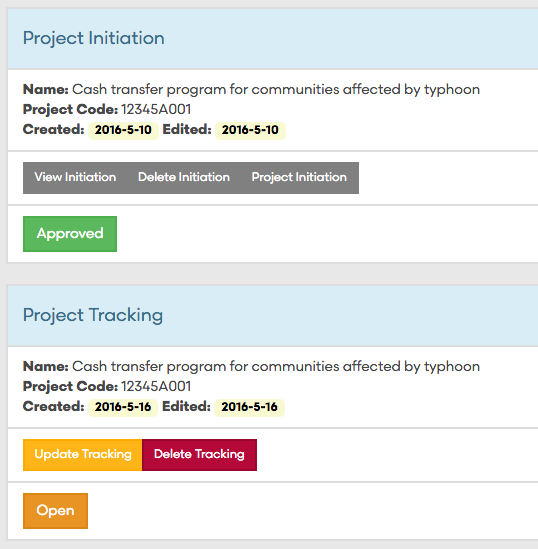
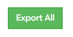
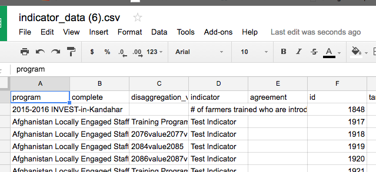

 <b> TolaData Release Notes for Users

These release notes start in May 2016 - Present

More details or to view other release history please see find us on GitHub: https://github.com/toladata

---

May 31st 2016

 <b> Workflow Form Name Changes: 

<b> Project Initiations and Project Tracking Forms

Agreements and Completions changed to:
**Project Initiations and Project Tracking**

We upgraded the name of our two main workflow forms to better define their use in workflow. 

**Project Initiation**

Initiates the start of a project and describes the justification, start, and end date, estimated budget, and approvals for any project.  This documents the WHAT and links to the site and stakeholder profiles. 

**Project Tracking**
Tracks and documents what actually happened (dates, budget, results) in a project compared to what was estimated in the Initiation Form. Additionally, it also documents the impact of the project and any lessons learned or issues/challenges. 

 <b>Indicator Visual Report Filters

<b>  [Tola.Work: 513](http://tola.work/helpdesk/tickets/513/)
Indicator Visual Report Filters fixed 

---

May 27th, 2106

 <b>Updates and Fixes to "Send to TolaActivity" from TolaTables

---

May 22, 2016 

 <b>Footer Update 
TolaData: Built by MercyCorps

 <b>API Updates
Further restriction based on user's access to API

 <b>Form Guidances Administration Moved to Admin
Form Guidance URLs are now managed in Admin. 
Form Guidance Admins no longer need to overwrite the current document to retain the same URL. 

---

May 21st, 2016

 <b> New Program ID - GAIT Links Removed
All links to GAIT were removed from the Program Names and replaced with Program IDs

---

 May 20th, 2016

 <b> Indicator Report "Export All" Fixed

<b>[Tola.Work:194](http://tola.work/helpdesk/tickets/194/) 

 

---
May 11, 2016

 <b> More work on Custom Dashboards. Coming soon!

---
 May 9th, 2016 

<b> [Tola.Work:477](http://tola.work/helpdesk/tickets/477/)

 <b> Admin Updates and New Document link fixed

 <b> Country Search in Admin for Strategic Objectives fixed

#### New "Unique Column" Alert 

Users will now see a message in TolaTables, when turning on Auto-Pull or Auto-Push, if they have not set up a unique column.

 <b> Concatenate/Join Merge Fixed in TolaTables

---
May 5th, 2016

 <b> New Scripts to Import Admin Levels

Upates to User Interface in Table View
Several user interface updates have been made to make changes or settings to your Tables easier: 
There are now links back to Table View from Table edit page and back from Table edit page to Table View page
"Auto Update and Push Your Data" and  "Edit or Update your Tables" are now collasped menus
"Unique Column" is now easily identified and labeled at top of Table

---
 May 3rd, 2016

 <b> New "View Only" User Group

Admins can now assign users View Only access. All new users will have "View Only" access until an Admin adds removes them from View Only and adds them to one of the other User Groups. If a user is assigned View Only group, they will not be able to edit any of the forms and will receive “Access Denied” pages for sections they cannot edit. 

 <b> Data Collected Form Update Achieved Count from TolaTable

The achieved count in your Data Collected Form for your indicators can now be updated automatically with the unique count total of a linked TolaTable

