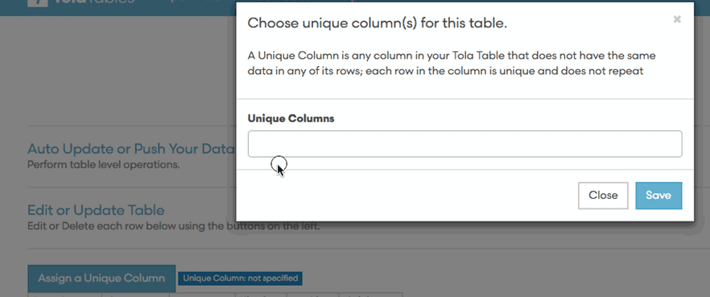
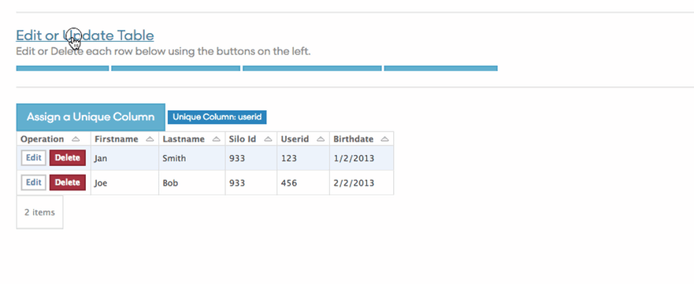
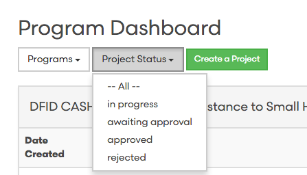

# June 21 - 2016

June 21 2016

---

 <b>Update: Added import JSON feed to TolaTables [TW:225](http://tola.work/helpdesk/tickets/225/http://tola.work/helpdesk/tickets/225/http://tola.work/helpdesk/tickets/225/)

Details: Import data from external services using their JSON feed

 <b>Unique Column Identifier 

When a user sets a unique column the page identifier now refreshes so the user can see the column is now set as unique without having to reload the page. 

 

 <b>Updated "Update" button 

Previously the Update button only updated merged tables, now you can use the Update button to do a manual pull of your data from JSON, Google Sheets and Ona source

 <b>Sort Projects in the Program Dashboard 

