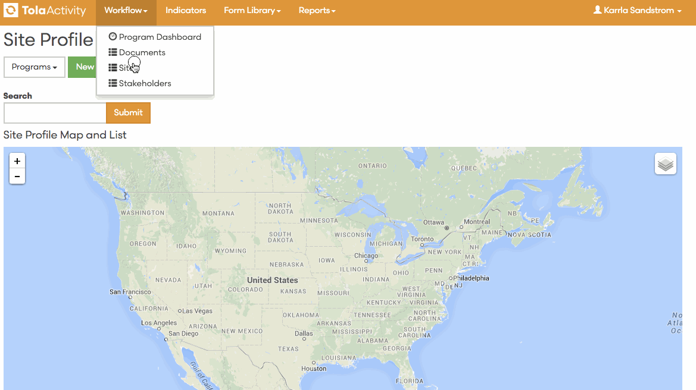

# Sites
A site defines the geographical location(s) of a program. 

---
###Value of Monitoring Sites
* 
Sites provides the ability to generate a visualization of our program/project locations on a map. 
* 
It allows teams to monitor performance within a specific location. 
* 
Supports the ability to manage in areas with remote access. 
* 
Over time, it allows teams to track the history of interventions showing how the programming has evolved.

###Site Form

* 
Profile: description and contact info 
* 
Location: lat/long
* 
Demographic Information: household (SADD), land, literacy, source documentation
1. 
Approvals

###Adding Sites
Sites can be entered through the Site Form in TolaActivity 

