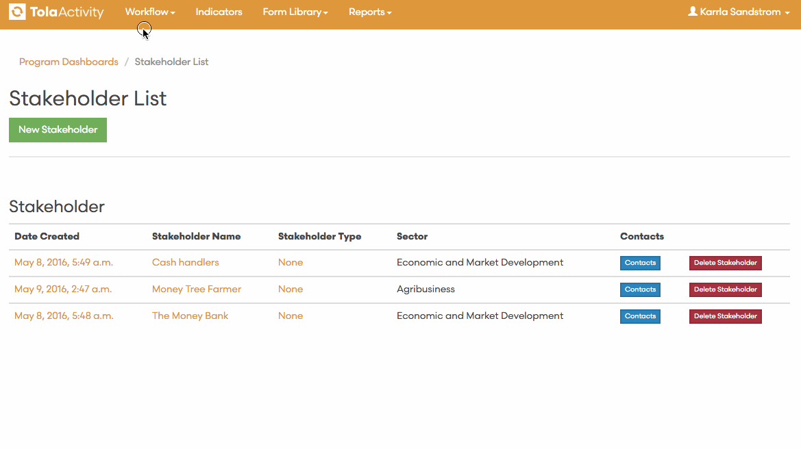

# Stakeholders

A stakeholder defines who the program is working with.

Stakeholders are persons or organizations whether in the public, private or civil sector, whose interests may be positively or negatively affected by Mercy Corps’ decisions, actions and ensuing results.

* 
Stakeholder type Contact details 
* 
Supporting documentation: Memorandum of * 
* 
Understanding (MOU), due diligence, etc  
* 
Approvals

Stakeholders can be added to through the TolaActiviy Stakeholder form

There is also a Contact List in TolaActivity which you can use to your contacts to your Stakeholders.

