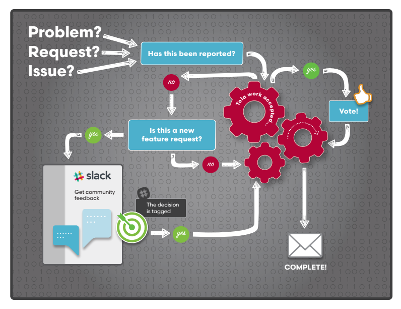

# Feedback and Reporting Issues
We <b>welcome and encourage</b>   your feedback and requests!  

We have a few tools to help us support you!
 
 
 

 

---

###We are on **[Slack](https://tola-users.slack.com/messages/general/)!**:clap:  
Join the discussions!  
Ask questions, get feedback, find answers...

And 
###We have a shared work queue: [TOLA.WORK](http://tola.work)!

We love feedback on trouble issues and input on new ideas. 
 You can even vote on your favorite new enhancements! We **encourage** it. 

#####<u>Help us prioritize the features users what you want!

Let's face it we all have great ideas, but sometimes there are so many great ideas, we need more than one person to input on it.

That's why we ask you discuss and vote! 

####<u>TolaData TolaWork Decision Process 

fig.1 [Search](http://tola.work/helpdesk/tickets/)
 and [Vote!](http://tola.work/helpdesk/tickets/)
###Tickets

####Entering Ticket

New to the idea of entering tickets?   Here are some good questions to answer when entering a new [Tola.Work](http://tola.work) ticket 

* 
<i>What browser are you using?

* 
<i>What, if any, error message did you get?

* 
<i>What did you expect to happen?

* 
<i>What did happened? 

#####<u>Example of a ticket lacking the details we need:
" I found an error when I was working in Tola Activity."

<i>We truly want to get to fixing the issue for you, but it's hard to know where to start troubleshooting without more information...

**<u>....And good ticket: **

"When clicking the submit button under Project (ID Number) then Program Initiation (Name of the Initiation)  and then Executive Summary, I get an error. 
  
I have pasted in the following error and the page URL where I found the error."

<i> Now that is more like it! We can immediately start looking into the issue! Thanks!

####Types of ticket

We have three types of tickets to help us prioritze the Tola.Work queue

<b>Problems:</b> Choose problem when you are requesting help with something you are having an issue with it, but you can still get your task done.

<b>Errors/Bugs:</b> If you receive and error or there is unexpected behavior, especially when you cannot finish your task!

<b>Enhancements:</b> 
Anything you or your colleague would like to see added or changed, but is not broken!  Remember the diagram? Enhancements requests **need votes** to get pushed up to the Tola.Work queue! So get your colleagues to vote too!

##**TolaData Form Guides**
We've create Form Guidance to all Tola Activity Forms. You can reference them on each form pages by clicking the blue Form Help/Guidance button on the page.

           
Form Guides are also accessible from the TolaData Public Google Drive folder.

All Form and Form Guides are managed by the TolaData project team and need to go through Tola.Work change requests. 
See Form and Form Guide Change Requests

##TolaData YouTube

We have a [YouTube channel](https://www.youtube.com/channel/UCBVZf-TVxQ3aNhJUOXB71nQ)!
Find helpful how-to screencasts and monthly recorded updates from the project team. 

If you would like to add to the screencast, please help us out and create your own to add to the channel, we welcome the help

The channel includes how to steps on: linking evidence, filling in the project initiation and tracking forms, creating custom and standard indicators, a full demo of TolaActivity and TolaTables and many more. 

