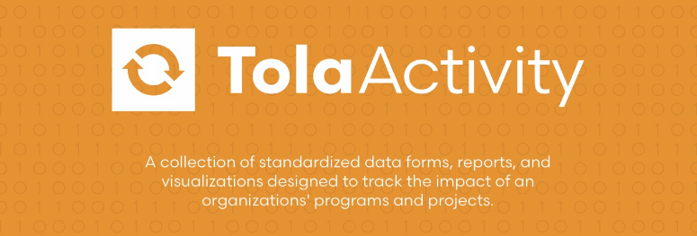

##**Harmonize workflow.**
Project Workflow is a set of standard forms that are used for project or activity-level management, facilitating traceability of data through documentation of evidence. It utilizes a set of dashboards and reports to track the progress of a project within the standard forms, workflow and process.  Currently, there are four primary forms: 1) Project Initiation, 2) Project Tracking, 3) Site Profile, and 4) Stakeholder Profile. The Site Profile form designates a geographical location and set of contacts within that location where a project or set of projects will be working.  The Stakeholder Profile form indicates who a project will work with and documents the type of relationship we have with them. The Project Initiation form sets the description, budget and analysis points for a project and documents details necessary for planning and implementation of a project.  The Project Tracking form documents the conclusions of the project and the variance between the Initiation (estimates) and the final state of the project (actuals).

##**Promotes adaptive management.**
Each stage of a project is tracked within dashboards allowing managers to see progress at a glance and the ability to drill down to get details or enter more information.  The four primary project forms are supplemented by standard Training and Beneficiary registration forms with links to individual attendance and beneficiary registration forms.  Project Workflow also includes a larger documentation repository to help track more in-depth or qualitative details of the project as well as a checklist, that can be customized by the user, to track and document the progress of an project as it nears the completion stage.

##**Evidence-driven Results.**
The Indicator Tracking tool is used to create a set of activity, output, outcome and goal indicators for each program, helping donors and staff track the performance of a program or project.  The indicators are defined and agreed upon by the donor(s) before a program is created in the system, then imported via a data service or manually entered.  Progress against each indicator is documented via data entry forms directly through the system or imported through a digital data collection tool or data consolidator like Tola Tables.  These indicators are then linked back to projects tracked through Project Workflow to track targets vs. actuals.

