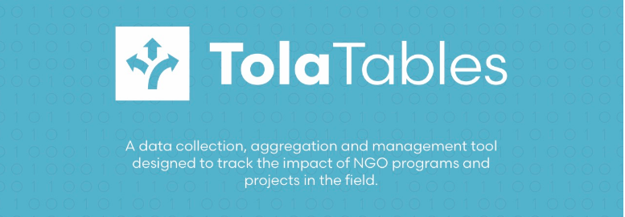
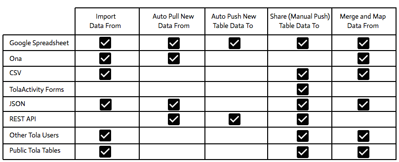

##TolaTables
A data collection, aggregation and management tool for all types of data collection methods designed to track the impact of NGO programs and projects in the field.  Designed initially to solve the problem of duplicate, disaggregated or broken data from mobile data collection platforms suchs as FormHub and iFormbuilder, it is now integrated with multiple data collection platforms and provides merge, auto download, cleaning, editing, sharing and analysis tools for all types of data.  It also provides the data service back end for other Tola tools such as Tola Workflow.

##Mobile
TolaTables directly integrates with mobile data collection providers such as Ona to provide users with access to all of their forms and data for import and management in Tola.  Each data set is then manage in its own silo that can then later be mapped and merged into any number of other data silos owned or shared with the user.

##Open Source, Open Data
Each table can be shared as a public repository with other users or exported as a Google sheet, Excel file, or through our external REST data service API for integration with other data platforms or analysis tools.

##Cleaning
Tola Tables also provides direct record editing and clean up within the tool as well as a set of map and merge tools to allow the user to merge multiple data silos into one.

##Push, Pull, Merge

