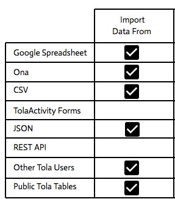

#Importing Data

---

##Import Data

TolaTables directly integrates with mobile data collection provider Ona to provide you with access to all of your data for import and management in Tola, or you can also import any JSON feed, CSV spreadsheet or Google Sheet of data you have. 

Each data set is then managed on its own and can then later be mapped, merged and updated into any number of other Tables owned or shared with you.  

TolaTables is continuously updating as resources permits; please see known issues that we are working on at the bottom.  

##Import, Push, Pull and Merge Options (as of June 2016)**

AS of June 2016 when you choose Import Data you have four options to import your data. Either the universal format of CSV, Google Sheet a JSON feed or directly from Ona. If you have your data in Excel, simply save it as a CSV file format before importing it to TolaTables.  

##Import CSV Steps
* Go to Import Data.

* Choose Import CSV Name your source and describe it

* Choose your File and Save!

* Last Name your new Table and Submit 

