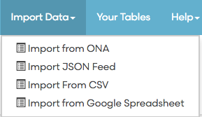
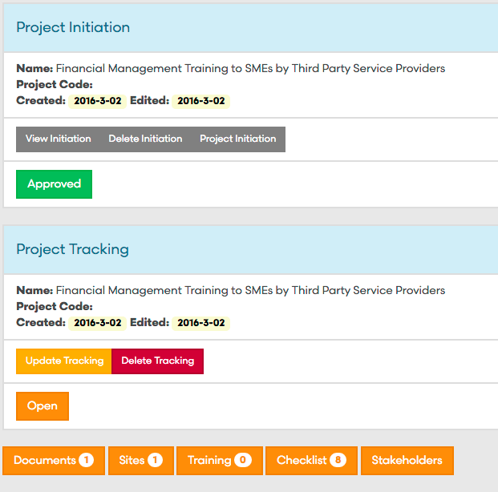
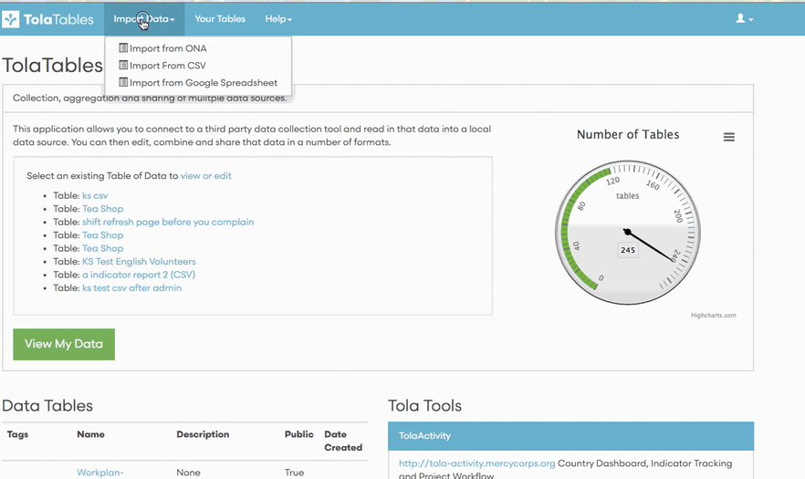
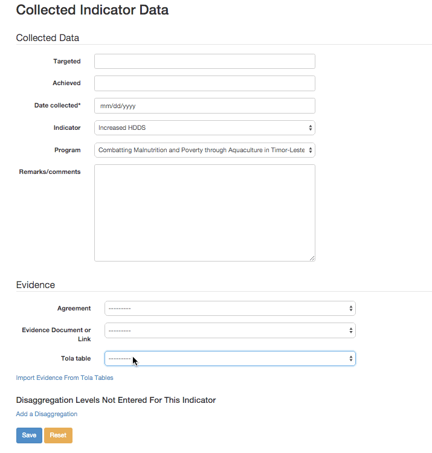
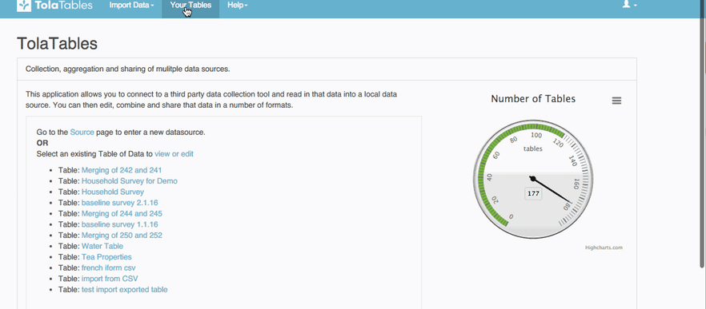

# What's New in TolaData?

---

###Import JSON feeds to TolaTables 
You can now import data from external services using their JSON feed!

---

###Workflow Form Name Changes: Project Initiations and Project Tracking
We upgraded the name of our two main workflow forms to better define their use in workflow. 

**Project Initiation**
Initiates the start of a project and describes the justification, start, and end date, estimated budget, and approvals for any project.  This documents the <b>WHAT </b> and links to the site and stakeholder profiles.  
**Project Tracking**
Tracks and documents what actually happened (dates, budget, results) in a project compared to what was estimated in the Initiation Form. Additionally, it also documents the impact of the project and any lessons learned or issues/challenges. 

---

###Import Google Sheets!  
You can now import your Google Sheets directly in TolaTables!
The first time you import a Google Sheet you will need to authorize TolaTables to view your Data in Google Drive.

---

###Import TolaTable Evidence Directly from TolaActivity
You can now directly import any of your TolaTables as evidence while in TolaActivity.

---

###Merge TolaTables
You can merge <b>all columns</b> in your selected merge tables, by mapping just one similar column and the rest will automatically be mapped. 

